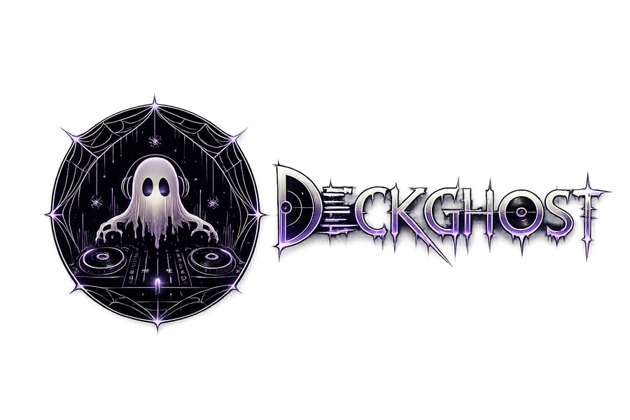
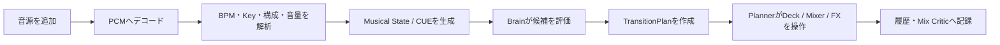
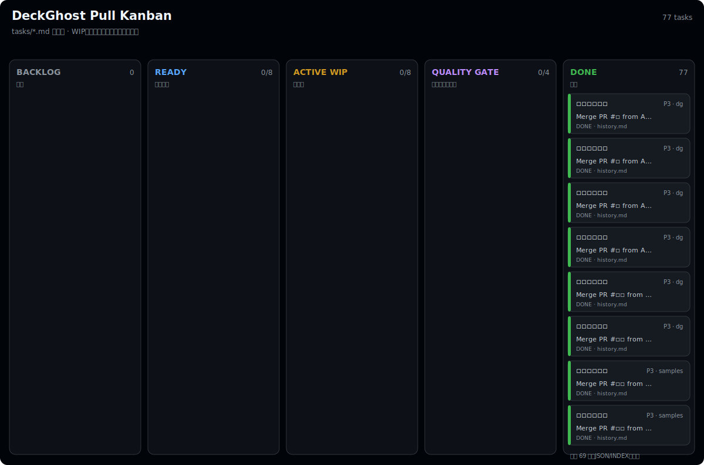
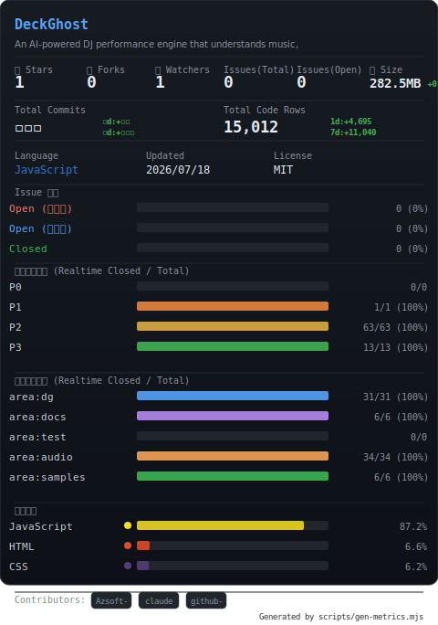
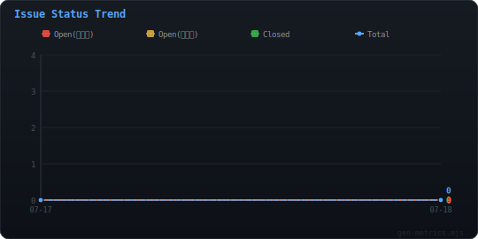

<p align="center">
  
</p>

# DeckGhost

**AI / Algorithmic DJ Performance Engine**

DeckGhostは、ブラウザ上で楽曲を解析し、選曲、CUE、トランジション技法、EQ、フェーダー、FXの操作計画を組み立てて演奏する2デッキDJエンジンです。Pioneer DJのCDJ + DJMを意識した操作系に、楽曲解析、AutoMIX、Performance Lab、Mix Criticを統合しています。

> **設計原則:** 判断エンジンは演奏計画を作り、DSPはその計画を決定論的に実行する。

音声解析と再生はブラウザ内で完結します。ローカルファイルをサーバへアップロードせずに利用でき、同梱サンプルまたは合成デモだけでもすぐに試せます。

## まず5分で試す

### 必要な環境

- Node.js 22以上
- npm
- Web Audio API / AudioWorkletが利用できるブラウザ

出力デバイス選択やWeb MIDIも含めて試す場合は、Chromium系ブラウザを推奨します。ブラウザによって利用できるAPIが異なるため、一部機能は表示されても使用できないことがあります。

### 起動

```bash
npm install
npm start
```

ブラウザで `http://localhost:3000` を開きます。ポートを変える場合は次のように起動します。

```bash
PORT=8080 npm start
```

### AutoMIXまでの最短手順

1. 画面を一度クリックし、ブラウザのオーディオエンジンを有効にします。
2. `DEMOトラック生成`、同梱サンプルの選択、または`ファイルを開く`で2曲以上追加します。
3. 右上の進捗表示が消え、ライブラリへBPM / KEY / TIMEが表示されるまで待ちます。
4. `全曲をAUTO MIXキューへ`を押します。
5. Performance Labを`AUTO`、Transition Composerを`OFF`にします。
6. ヘッダーの`AUTO MIX`を押します。

最初は `AUTO FX: OFF / PERF MIX: OFF` にすると、基本の選曲とトランジションを確認しやすくなります。画面内の詳しい操作説明は[DeckGhostヘルプ](public/help.html)を参照してください。

## DeckGhostが行うこと



AutoMIXは単純なクロスフェードではありません。現在曲と次曲について、BPM、拍位相、Camelot、区間コード、スペクトル、セクション、CUE、残り時間、直前の技法履歴を比較し、実行可能な60技法から計画を選びます。実行時は次曲をミュートした状態で先行再生し、キック位置を補正してからEQ、チャンネルフェーダー、クロスフェーダー、FXを段階的に動かします。

拍ロックの信頼度が足りない場合や曲末の余裕がない場合は、短いカットまたはセーフフェードへ縮退します。Plannerが選んだ内容は`NEXT TRANSITION PLAN`と全体波形上のMIX区間で確認できます。

## 主な機能

| 領域 | 機能 |
|---|---|
| Deck A / B | PLAY、CUE、HOT CUE 8スロット、1〜8拍LOOP、BEAT JUMP、TEMPO、SYNC、KEY LOCK、キーシフト、ジョグ全体およびズーム波形の直接タッチスクラッチ(一時停止中も可)、UNLOAD |
| Mixer | TRIM、3バンドEQ、COLOR LPF/HPF、チャンネルフェーダー、等パワークロスフェーダー、VU、マスターLimiter、Safety Gain |
| Monitor | Deck A/BのPFL、Master CUE、対応ブラウザでの別出力デバイス選択 |
| Beat FX | ECHO、DELAY、REVERB、FLANGER、PHASER、FILTER、LPF、HPF、CRUSH、ROLL、GATE、DISTORTION、NOISE、BACKSPIN |
| Analysis | BPM、Beatgrid、Key / Camelot、コード列、スペクトル、エネルギー、セクション、フレーズ、テンポ変動、無音、ラウドネス、LRA、近似True Peak、波形ピーク |
| Brain | 役割付きCUE、調性互換、区間コード互換、音域衝突、同期成立性、技法履歴を使ったTransitionPlan生成 |
| Auto performance | AutoMIX、セクション連動AUTO FX、切り替えを伴わないPerformance MIX、低域の濁りを防ぐ Progressive Bass Swap 補間、PLL位相補正、セーフフェード |
| Editing | BPM直接入力 / ½× / ×2 / TAP、GRID nudge、1拍目設定、キー手動補正、CUE Workbench、再解析 |
| Lab | 解析優先AUTO、Smooth House、Festival Slam、Vocal Safe、Bass Surgeon、Transition Composer、Plan Timeline、History |
| I/O | Web MIDI IN/OUT、MIDI Learn、MIDI Clock、WebM録音、プロジェクトJSON、セッション記録 / リプレイ / JSON、IndexedDBによる音声キャッシュ(LRU 250MB上限) |
| Responsive UI | デスクトップ表示、スマートフォン向けDeck / Mixer / 分析パネルのタブ表示 |

技法知識ベースは[`data/techniques.json`](data/techniques.json)に67件を保持しています。このうち現行のDeck / Mixer / FXで成立する技法だけがAutoMIX候補になります。歌詞タイムコード、音階MIDI、分離済みステムが必要なWord PlayやStem操作などは、知識として保持していても現在の実行候補には入りません。

## 曲の追加と解析

### 音源の追加方法

| 方法 | 操作 | 特徴 |
|---|---|---|
| 同梱サンプル | 単曲選択、または「全曲追加」で一括読込 | 25曲。SHA-256と容量を検証してから解析 |
| ローカルファイル | `ファイルを開く`またはライブラリへドラッグ&ドロップ | 音声はブラウザ内で読込・解析 |
| 合成デモ | `DEMOトラック生成` | Camelot互換の5曲をブラウザ内で合成 |
| サーバライブラリ | `tracks/`へ音源を置き、`サーバから読込` | ローカルNode.jsサーバ利用時のみ |

Node.jsサーバが列挙する拡張子はMP3、WAV、OGG、M4A、FLAC、AAC、WebMです。実際にデコードできる形式はブラウザのコーデック対応にも依存します。

### 解析中の表示

長い処理では、画面右上（モバイルでは右下）のプログレス表示に現在の工程と全体進捗を表示します。

- ファイル読込またはダウンロード
- SHA-256検証
- PCMデコード
- BPM / Beatgrid
- Key / Camelot
- スペクトル
- セクション / フレーズ
- テンポ変動 / 無音
- ラウドネス / True Peak
- 波形ピーク生成

解析工程の間ではブラウザ描画へ制御を戻すため、長尺曲でも画面が完全に停止したように見えないようにしています。複数ファイルはピークメモリを抑えるため1曲ずつ処理されます。

### 同梱サンプル

`public/samples/`の21曲は約`-14 LUFS`、最大`-1 dBTP`を基準に正規化しています。曲順、表示名、容量、SHA-256、正規化条件は[`public/samples/manifest.json`](public/samples/manifest.json)が正本です。音源を置き換えた場合は、`bytes`と`sha256`も必ず更新してください。

## メモリ管理とOOM対策

圧縮されたMP3は、再生前に非圧縮PCMの`AudioBuffer`へ展開されます。概算メモリは次の式です。

```text
PCM bytes = sample frames × channels × 4 bytes
```

たとえば48 kHz / stereo / 5分の曲は、PCMだけで約110 MiBになります。ライブラリ全曲のPCMを保持するとブラウザがOOMになり得るため、DeckGhostは次のルールで管理します。

- ライブラリには解析結果、波形ピーク、SHA-256、再読込元を残す
- 再生中または次のMIX準備中の曲はPCMを保護する
- デスクトップは保護中の曲に加え、最大1曲・192 MiBまでのアイドルPCMをLRU保持する
- モバイルはアイドルPCMを即時解放する
- 新しいデコードの前に、保護対象でないPCMを解放する
- 解放済みの曲はDeck投入時にファイル、URL、またはデモ定義から直列再デコードする
- AutoMIXは遷移のおよそ30秒前から次曲を準備する

ライブラリ上部の`PCM n曲 / n MB`で現在の保持量を確認できます。`RAM`はPCM保持中、`·`は解析済みだがPCM解放済みであることを示します。`UNLOAD`はデッキから曲を外し、不要になったPCMを解放可能な状態へ戻します。

## Beatgridと解析結果の補正

自動解析は推定です。キック、BPM、キー、セクションが実際の曲と合わない場合は手動補正してください。

### BeatGrid V2 (TempoMap) システム
DeckGhostは、従来の固定BPM・単一起点前提のシステムから、可変テンポおよび変拍子（Meter）に対応した **BeatGrid V2 (TempoMap)** システムへと移行しました。
- **TempoMapによる時間・拍・小節の相互変換**: 局所的なテンポ変化や変拍子を記述する `TempoMap` クラスを導入。`timeAtBeat` や `beatAtTime` の誤差のない双方向変換により、可変テンポ曲でも完璧な同期と正確な小節数カウントを実現します。
- **拍子（Meter）セグメント**: 曲の途中で拍子（4/4拍子から3/4拍子など）が変わる変拍子曲をサポート。小節線描画や拍カウントも自動的に追従します。
- **手動グリッド調整**:
  1. 波形またはジョグで本当の小節先頭へ移動します。
  2. `1拍目`を押し、その位置を現在小節の先頭拍に合わせます。既存の小節番号は維持されます。
  3. 4小節フレーズの頭が分かる場合は、その位置で`1小節目`を押してその4小節ウィンドウの起点を設定します(曲全体の絶対起点は動きません)。
  4. 小さなズレはGRIDの1 / 10 / 50 ms、1拍のズレは`-1 BEAT / +1 BEAT`で調整します。
  5. BPMが半分または2倍なら`½× / ×2`を使います。`TAP`は4回以上叩き、入力が止まってから一度だけBPMを確定します。
  6. Keyは半音単位とMajor / Minorを手動補正できます。
  7. セクションとCUEも更新する場合は`再解析`を押します。

補正値は音源内容のSHA-256をキーとして `localStorage`（キー: `deckghost-gridmap-v2`）へ保存されます。同じ内容のファイルを再読込すると、ファイル名が違っても保存済みGridを最優先で復元します。読み込み時には従来のV1保存値（`deckghost-gridmap-v1`）からの自動移行が行われます。`グリッド書き出し / 読込` でJSONとしてエクスポート/インポート可能です。

## データの保存範囲

| データ | 保存先 | 注意 |
|---|---|---|
| BPM / Grid / Key補正 | ブラウザ`localStorage` | SHA-256単位。JSONで書出し / 読込可能 |
| MIDI Learn | ブラウザ`localStorage` | ブラウザプロファイル単位 |
| Project JSON | ユーザーがダウンロード | 解析結果、CUE、キュー、計画、履歴。音声データは含まない |
| Session JSON | ユーザーがダウンロード | Deck / MixerスナップショットとPlannerイベント。音声データは含まない |
| Recording | ユーザーがダウンロード | Safety Gain適用後のMasterをWebM / Opusで記録 |

セッションリプレイは、記録時と同じトラックIDを現在のライブラリから解決します。別環境へJSONだけ移しても、対応する音源がない場合は完全には再現できません。

## 開発

### プロジェクト管理

[](docs/PROJECT_MANAGEMENT.md)

[](docs/PROJECT_MANAGEMENT.md)

[](docs/PROJECT_MANAGEMENT.md)

DeckGhostはPrivate側でProject Janus型のファイル正本プロジェクト管理を採用しています。Public版には、公開可能なマスク済み状態SVGと、エージェントルール/Skills/タスク管理資料のサンプルを同梱しています。概要は[`docs/PROJECT_MANAGEMENT.md`](docs/PROJECT_MANAGEMENT.md)を参照してください。

公開状態のSVGは[`deckghost-status.svg`](public/status/deckghost-status.svg)、[`deckghost-repository.svg`](public/status/deckghost-repository.svg)、[`deckghost-issue-trend.svg`](public/status/deckghost-issue-trend.svg)として同梱されています。これらは内部タスクID、Issue番号、PR番号、Private側commit情報を含まないマスク済みSVGです。

### コマンド

```bash
# Node.jsローカルサーバ
npm run dev

# 全テスト
npm test

# タスク/Docs/Kanbanの検査
npm run check:project

# タスクダッシュボード、Kanban、GitHub Metricsの生成
npm run gen:project

# Cloudflare Workersローカル開発
npm run cf:dev

# Cloudflare Workersへデプロイ
npm run cf:deploy
```

テストは解析、PCMキャッシュ、AutoMIX、Brain、Deck、FX、サンプルmanifest、波形描画を対象にしています。サンプルテストは全音源の存在、25 MiB以下のアセット制約、容量、SHA-256を検証します。

### プロジェクト構成

```text
DeckGhost/
├── public/
│   ├── index.html              # DJコンソール
│   ├── help.html               # 利用者向けヘルプ
│   ├── css/                    # コンソール / ヘルプのスタイル
│   ├── js/
│   │   ├── app.js              # UI統合、読込、進捗、永続化
│   │   ├── analysis.js         # 楽曲解析
│   │   ├── audio-memory.js     # PCMサイズ計算とLRUキャッシュ
│   │   ├── brain.js            # CUE、評価、TransitionPlan
│   │   ├── automix.js          # Plannerと決定論的実行
│   │   ├── deck.js             # Deck再生とTransport
│   │   ├── mixer.js / fx.js    # Mixer、PFL、FX、Safety Gain
│   │   ├── composer.js         # Transition Composer
│   │   ├── midi.js             # Web MIDI
│   │   ├── session.js          # セッション記録 / リプレイ
│   │   └── waveform.js         # 波形描画
│   └── samples/                # 同梱MP3とmanifest
├── server/index.js             # Express静的配信、tracks、Brain API
├── worker/index.js             # Cloudflare Worker版Brain API
├── data/techniques.json        # 67技法の知識ベース
├── docs/                       # 詳細設計、管理運用、索引
├── scripts/                    # Public smoke test
├── .agents/skills/             # エージェント向け条件付き作業ルール
├── test/                       # Node.jsテスト
└── tracks/                     # ローカルサーバ用音源置き場
```

## Node.js版とCloudflare版の違い

| 機能 | Node.js / Express | Cloudflare Workers |
|---|---:|---:|
| `public/`の静的配信 | 対応 | Assets bindingで対応 |
| Brain API | 対応 | 対応 |
| `tracks/`の一覧・配信 | 対応 | 未対応 |
| `POST /api/tracks/:name` | ローカルFSへ最大200 MiB | 未対応 |
| ブラウザからのローカルファイル読込 | 対応 | 対応 |
| 同梱サンプル / 合成デモ | 対応 | 対応 |

Cloudflare Workersには永続ローカルファイルシステムがないため、サーバライブラリを提供する場合はR2などのストレージ実装が別途必要です。

## 現在の制約

- BPM、Key、コード、セクション、True Peakはブラウザ内信号処理による推定であり、業務用解析器や厳密なBS.1770測定と一致する保証はありません。
- 可変テンポ曲では長い拍同期技法の信頼度が下がります。必要に応じてBeatgridを補正してください。
- Vocal Activity、歌詞同期、Stem分離は未実装です。これらが必要な技法は自動実行しません。
- ROLLは簡易キャプチャ方式で、独立したAudible / Logical playheadを持つ完全なSlip Rollではありません。
- 録音形式はブラウザの`MediaRecorder`が提供するWebM / Opusです。WAV録音は未実装です。
- 出力デバイス分離、Web MIDI、AudioWorklet、コーデック対応はブラウザと端末に依存します。

## 困ったとき

| 症状 | 確認すること |
|---|---|
| 音が出ない | 画面をクリックしてAudioContextを開始し、PLAY、チャンネルフェーダー、Crossfader、MASTER、出力先を確認 |
| AutoMIXが始まらない | 解析完了済みの曲が2曲以上あり、AUTO MIX QUEUEに曲が入っているか確認 |
| 拍が二重に聞こえる | GRID線とキックを確認し、1拍目、GRID nudge、BPM ½× / ×2で補正 |
| 読込中にメモリが増える | 複数曲を同時操作せず処理完了を待ち、不要なDeckをUNLOAD。`PCM n曲 / n MB`を確認 |
| サンプルが読めない | manifestの`bytes` / `sha256`と実ファイルが一致するか`npm test`で確認 |
| サーバ曲が0件 | Node.js版で`tracks/`へ対応形式の音源を置いているか確認。Worker版のtracks APIは空配列を返す |

## ドキュメント

- [画面内ヘルプ](public/help.html) — 初回操作、AutoMIX、手動MIX、FX、MIDI、トラブル対応、用語集
- [技法知識ベース](data/techniques.json) — 技法メタデータと実行可能フラグ

## License

DeckGhostのソースコードは[MIT License](LICENSE)で公開されています。

`public/samples/`内のサンプル音源にはMIT Licenseは適用されません。これらの音源はDeckGhostの動作確認、評価、デモ用途として提供されています。サンプル音源の利用条件については[`public/samples/LICENSE.md`](public/samples/LICENSE.md)を参照してください。
